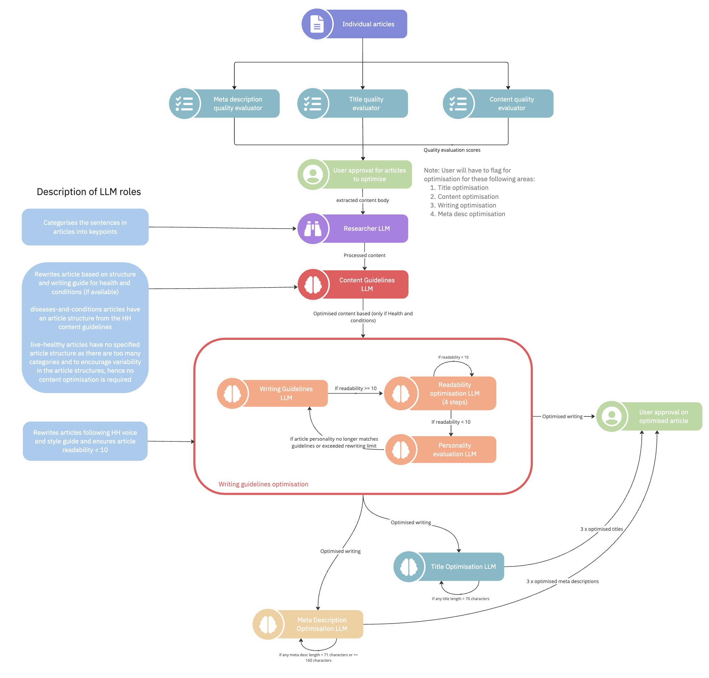
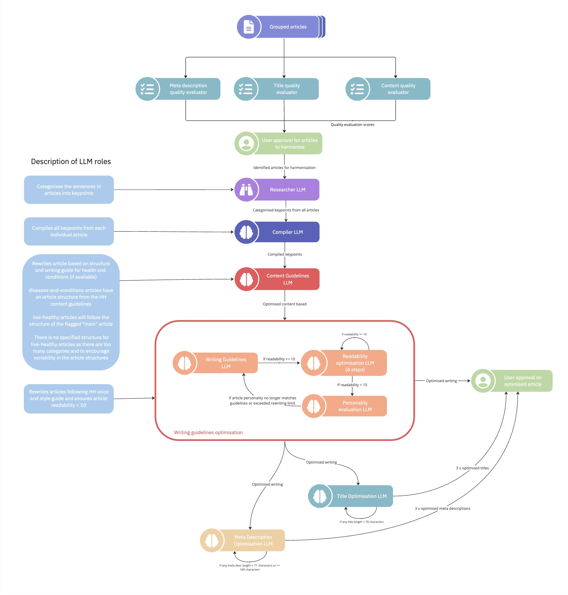

# Article Optimisation & Generation

## Introduction

This project will be utilizing Large Language Model (LLM) graphs to harmonise similar articles, followed article optimisation based on HealthHub content playbook guidelines.
The models are deployed through Azure OpenAI Endpoints. Currently, this project uses [GPT-4o-mini](https://azure.microsoft.com/en-us/blog/openais-fastest-model-gpt-4o-mini-is-now-available-on-azure-ai/) from Microsoft Azure.

> [!WARNING]
> The prompts for the HuggingFace models are not updated as we no longer use them. You will need to update the prompts and LLM Chains to mimic the implementation for Azure OpenAI Chat models.

The article rewriting process is broken up into 2 main processes -

1. Article Optimisation Checks
2. Article Generation

### Article Optimisation Checks

  <p align="center">
      
  </p>

### Article Generation

Article Generation has two unique processes, namely:

1. Article Optimisation
2. Article Harmonisation

#### Article Optimisation

  <p align="center">
      
  </p>

#### Article Harmonisation

  <p align="center">
      
  </p>

This diagram will be continually updated as more nodes are added in.

## Rules and Guidelines

- Don't remove any lines from the `.gitignore` file provided (although you may modify or add to it)
- Don't commit data to the repository
- Don't commit any credentials or local configuration to the repository. Remember to add `.env` to `.gitignore`

## Installation guide

### Setting up the Virtual environment

#### Anaconda (Recommended)

You can download the Anaconda Distribution for your respective operating system [here](https://docs.anaconda.com/anaconda/install/). You may also find out how to get started with Anaconda Distribution [here](https://docs.anaconda.com/anaconda/getting-started/). To verfiy your installation, you can head to the Command Line Interface (CLI) and run the following command:

```zsh
conda list
```

You should see a list of packages installed in your active environment and their versions displayed. For more information, refer [here](https://docs.anaconda.com/anaconda/install/verify-install/).

---

Once set up, create a virtual environment using `conda` and install dependencies:

```zsh
# Create a virtual environment
conda create -n <VENV_NAME> python=3.12 -y
conda activate <VENV_NAME>

# Install dependencies
pip install -r requirements.txt
```

#### venv

You can use Python's native virtual environment `venv` to setup the project

```zsh
# Create a virtual environment
python3 -m venv <VENV_NAME>
```

You can then activate the environment and install the dependencies using the following commands -

For UNIX-based systems (macOS / Linux):

```zsh
# Activate virtual environment
source <VENV_NAME>/bin/activate

# Install dependencies
pip install -r requirements.txt
```

For Windows:

```powershell
# Activate virtual environment
.\<VENV_NAME>\Scripts\activate

# Install dependencies
pip install -r requirements.txt
```

> [!TIP]
> If you're using Python's native virtual environment `venv`, it is best practice to name your virtual environment `venv`.

---

### Installing Relevant Packages

Start by installing all the packages required to run the project.

```zsh
pip install -r requirements.txt
```

### Setting up Microsoft Azure OpenAI

First, install the Azure Command-Line Interface (CLI) to access the Azure resources. Refer to this [guide](https://learn.microsoft.com/en-us/cli/azure/) for the installation procedures.

Sign in to your Azure account via the CLI. Refer to this [guide](https://learn.microsoft.com/en-us/cli/azure/authenticate-azure-cli-managed-identity).

After a successful login, run the following command to check that your credentials are saved -

```bash
  az account show
```

Next, head to the [Microsoft Azure](https://www.portal.azure.com/#home) and set up the Azure OpenAI Chat Model Deployment.

Copy your new token and paste it under your `.env` file.

- Set the Resource Name as `AZURE_OPENAI_SERVICE`
- Set the Deployment Name as `AZURE_DEPLOYMENT_NAME`.
- Set the Endpoint URL (`AZURE_OPENAI_ENDPOINT`) as `f"https://{AZURE_OPENAI_SERVICE}.openai.azure.com/"`. Replace `{AZURE_OPENAI_SERVICE}` in the URL.
- Set the `AZURE_OPENAI_API_VERSION` to the latest version mentioned [here](https://learn.microsoft.com/en-us/azure/ai-services/openai/api-version-deprecation)

Finally, head to [`quickstart.py`](examples/quickstart.py) and run the file to check if your packages are working.

### Setting up LLM Observability via arize-phoenix

To set up the `arize-phoenix` LLM observability server -

```python
    # Launches the web server at http://127.0.0.1:6006
    python3 -m phoenix.server.main serve
```

If you are unable to run the server, perform the following command - `pip install 'arize-phoenix[evals]'`. For more information, refer to [`Phoenix Setup Environment`](https://docs.arize.com/phoenix/setup/environments).

## Instruction to run the project

### Adding the necessary inputs files

In order to run the project, you require 3 key files -

1. `merged_data.parquet` from the Data Processing pipeline - Refer to `content-optimization/data/03_primary/merged_data.parquet` to obtain the file.
2. `ids_for_optimisation.csv` from the Clustering Pipeline - Refer to `content-optimization/notebooks/exclude_articles.ipynb` to generate the file.
3. `Stage 1 user annotation for HPB (Updated).xlsx` from `Step 1 Harmonisation and Optimisation Checks` in the `LLM Exploration` Google Drive

### Running the Optimisation Checks Workflow

To run the project, first ensure that you have installed all the packages in `requirements.txt`.

Next, add the `merged_data.parqet` and `ids_for_optimisation.csv` to the `data` directory of the `article-harmonisation` project.

Ensure the following columns are present in `merged_data.parquet` -

1. `id`: Article ID
2. `extracted_content_body`: Article Content
3. `title`: Article Title
4. `category_description`: Meta Description of the article
5. `full_url`: URL of the article
6. `content_category`: Content Category of the article
7. `article_category_names`: Sub-categories of the article
8. `page_views`: Page views of the article

As for `ids_for_optimisation.csv`, ensure that the `article_id` column is present.

Then, head to [`checks.py`](checks.py) and run the file to start the article optimization checks workflow.

Currently, the article optimization checks is ran concurrently within the workflow. This may result in deadlocks.

To run the agentic framework on CLI -

```python
    # Install the requirements within `article-harmonisation` directory
    pip install -r requirements.txt
    # Change directory to ROOT
    cd ..
    # Run the python script
    python3 ./article-harmonisation/checks.py
```

### Running the Article Generation Workflow

To run the project, first ensure that you have installed all the packages in `requirements.txt`. Next, head to `main_harmonisation.py` and run the file to start the article harmonisation process.

Before running the project, you will also need to ensure that the User Annotation Excel file is placed in `article-harmonisation/data/article_rewriting` as the article rewriting process extracts data from the Excel file to determine which optimisation steps to take. Users will flag out the optimisation steps they wish to take under the column `User: additional content to add for harmonisation`.

As of 28 August 2024, the User Annotation Excel file name is set to "Stage 1 user annotation for HPB (Updated).xlsx" and the column for user annotation is "User: additional content to add for harmonisation". The User Annotation sheet name for article harmonisation is "User Annotation (to harmonise)" and the sheet name for article optimisation is "User Annotation (to optimise)"

You should also ensure that the 2 sheets named "Article Harmonisation Output" and "Article Optimisation Output" are in the User Annotation Excel file as the optimised outputs will be stored there

**Do ensure that the file name, user action column name and user annotation sheet names are still accurate to ensure that the project runs smoothly.**

When deciding which workflow to run, you will need to specify which function to use `optimise_articles` for article optimisation and `harmonise_articles` for article harmonisation in `main_harmonisation.py`.

To run the agentic framework on CLI -

```python
    # Install the requirements within `article-harmonisation` directory
    pip install -r requirements.txt
    # Change directory to ROOT
    cd ..
    # Run the python script
    python3 ./article-harmonisation/main_harmonisation.py
```

Finally, the output will be reflected in the User Annotation Excel file, under "Article Harmonisation Output" for Article Harmonisation and "Article Optimisation Output" for Article Optimisation.

### Running the streamlit application

> [!WARNING]
> The streamlit application is merely for prototyping purposes. It is not actively maintained due to the change in direction (i.e. generating Excel files instead).

To run the `streamlit` application -

```python
    # Install the requirements within `article-harmonisation` directory
    pip install -r requirements.txt
    # Run the streamlit demo
    streamlit run ./app.py
```

## File Structure

- [`agents`](agents): contains all the classes and functions to initialise the models, roles and prompts
  - [`enums.py`](agents/enums.py): python file containing classes to initialise the models from HuggingFace/Azure OpenAI and the roles involved in the Agentic Workflow
  - [`models.py`](agents/models.py): python file containing classes to instantiate each LLM used in the project
  - [`prompts.py`](agents/prompts.py): python file containing classes to instantiate prompts unique to each LLM type. Do note that different LLM will have different prompts that can be retrieved under their respective classes
  - [`prompts_archive.py`](agents/prompts_archive.py): python file containing classes to instantiate older prompts for each LLM type. Used to archive old prompts.
- [`data`](data): contains all the datasets pertaining to this project
  - [`final_articles`](data/marked_articles): contains the dataframes that are marked for article optimisation checks
  - [`optimization_checks`](data/optimization_checks): contains all the dataframes generated from the execution of `checks.py`
- [`docs`](docs): contains all miscellaneous documents pertaining to this project
  - [`images/`](docs/images): contains all images pertaining to this project
  - [`txt_outputs/`](docs/txt_outputs): contains all generated outputs from the chosen model when harmonisation.py is executed (stored as .txt file)
- [`examples`](examples): contains all the examples to test the execution of the LLM model
  - [`quickstart.py`](examples/quickstart.py): python file containing the script to test whether the Azure OpenAI model is working. Run this file to test if the azure resources and identity is functional.
- [`notebooks`](notebooks): contains all the Jupyter Notebooks to evaluate the project
  - [`calculate_tokens.ipynb`](notebooks/calculate_tokens.ipynb): Jupyter Notebook to calculate the tokens consumed by running the project for all articles
  - [`evalauate_word_count.ipynb`](notebooks/evaluate_word_count.ipynb): Jupyter Notebook to find a suitable threshold to perform `flag_below_word_count` for each content category
  - [`generate_annotation_excel.ipynb`](notebooks/generate_annotation_excel.ipynb): Jupyter Notebook to generate the Excel file from the Optimisation Checks output
  - [`readability_scores.ipynb`](notebooks/readability_scores.ipynb): Jupyter Notebook to calculate the readability scores for all articles
- [`states`](states): contains all the states used for the LangGraph workflow
  - [`definitions.py`](states/definitions.py): python file containing the TypedDict definitions used in the Optimisation Checks and Article Generation workflow
- [`utils`](utils): contains all the utility functions pertaining to this project
  - [`arize-phoenix.py`](utils/arize-phoenix.py): python file containing the functions related to `arize-phoenix` LLM Observability package
  - [`evaluations.py`](utils/evaluations.py): python file containing the metrics to evaluate the articles
  - [`formatters.py`](utils/formatters.py): python file containing functions to format inputs and outputs for ingestion and presentation purposes
  - [`graphs.py`](utils/graphs.py): python file containing functions to create, execute and draw LangGraph objects
  - [`paths.py`](utils/paths.py): python file to set the ROOT directory of the project (set at `healthhub-content-optimization`)
  - [`reducers.py`](utils/reducers.py): python file to support the merging of dictionaries when Optimisation Checks workflow is executed.
- [`.env.example`](.env.example): a template file for `.env` to contain the environment variables for the project.
- [`app.py`](app.py): python file containing the streamlit application
- [`checks.py`](checks.py): python file containing the Article Optimisation Checks workflow. Run this file to execute the optimisation checks process
- [`config.py`](config.py): python file containing the initialisation of environment variables for use within the project
- [`harmonisation.py`](harmonisation.py): python file containing the nodes and graph compilation for the Article Generation workflow.
- [`main_harmonisation.py`](main_harmonisation.py): python file to run the Article Generation. Run this file to execute the rewriting process.
- [`requirements.txt`](requirements.txt): txt file containing all the packages needed to run the project
