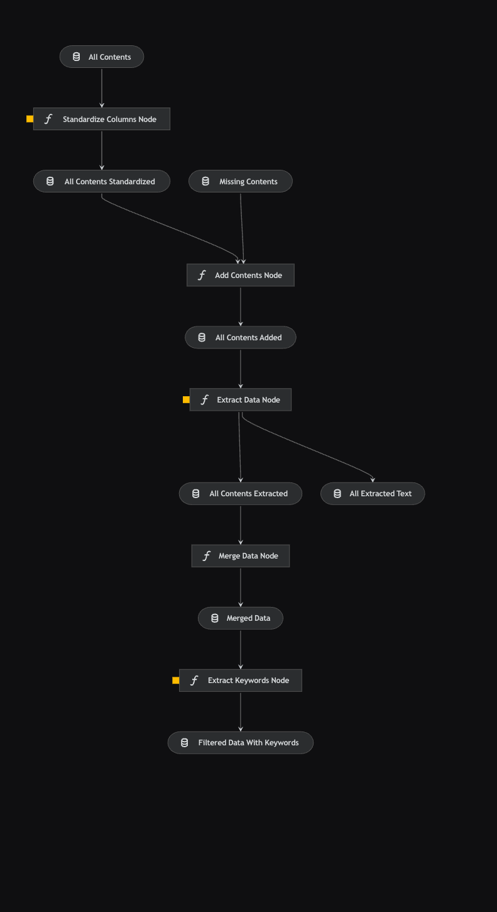

# Content Optimization

## Overview <a id="kedro-pipeline"></a>

> This Kedro project with Kedro-Viz setup was generated using `kedro 0.19.6`.

This visualization shows the current (latest) Kedro pipeline. This will be updated as the pipeline progresses.

<p align="center">
    
</p>

## Rules and Guidelines

- Don't remove any lines from the `.gitignore` file provided (although you may modify or add to it)
- Make sure any results can be reproduced by following a [data engineering convention](https://docs.kedro.org/en/stable/faq/faq.html#what-is-data-engineering-convention)
- Don't commit data to the repository
- Don't commit any credentials or local configuration to the repository. Keep all credentials and local configuration in [`conf/local/`](conf/local)

## Install Dependencies

<a id="note"></a>

> [!NOTE]
> This assumes that you have already created and activated your virtual environment. For more information on how to get set up, refer [here](../README.md#installation). From this section onwards, do also take note that you are in the `content-optimization` directory. Simply check by running `pwd` in your terminal and `cd content-optimization` if you're not already there.

### Anaconda (Recommended)

Declare any dependencies in `requirements.txt` for `pip` installation. To install them, run:

```zsh
pip install -r requirements.txt
```

### Poetry

If you're using Poetry instead, run:

```zsh
cat requirements.txt | xargs poetry add
```

## File Structure

- [`conf/`](conf): contains all configurations for the project

  - [`base/`](conf/base): contains all configurations for the parameters used in the pipelines

  - [`local/`](conf/local): contains all local configurations for the project like secrets and credentials (not to be checked into version control)

> [!IMPORTANT]
> If you find any discrepancies in the extracted or merged data, please [open an issue](https://github.com/Wilsven/healthhub-content-optimization/issues).

- [`data/`](data): contains all data for the project at every stages; there are many sub-directories but here are the notable ones (will be updated as the pipeline progresses)

  - [`01_raw/`](data/01_raw): contains all raw data

    - `all_contents/`: contains all the raw data provided by HealthHub for the project. Get the data [here](https://trello.com/c/n0cMa6k2).

    - `missing_contents/`: contains the content body of articles with `Excel Error` but were designated as `keep` by HealthHub. Get the data [here](https://trello.com/c/n0cMa6k2).

  - [`02_intermediate/`](data/02_intermediate): contains all intermediate data

    - `all_contents_standardized/`: contains all standardized data; kept only relevant columns and renamed the columns across all content categories to the same columns names

    - `all_contents_extracted/`: contains all extracted data; various data was extracted from the HTML content body. Refer to the [Dataset](#dataset-info) description below

    - `all_extracted_text/`: contains all the extracted HTML content body; saved as `.txt` files; for validation and sanity checks

    - `all_contents_mapped/`: contains all the new IA mappings as provided in the [kedro configuration](conf/base/parameters_data_processing.yml) as new columns

  - [`03_primary/`](data/03_primary): contains the primary data; all processes (i.e. modeling) after data processing should only ingest the primary data

    - `merged_data.parquet/`: contains the merged data across all content categories and versioned; for more information on the data schema, refer [here](#data-schema)

    - `filtered_data_with_keywords.parquet/`: contains the filtered data with keywords and versioned; for more information on the data schema, refer [here](#data-schema)

  - [`04_feature/`](data/04_feature): contains the features data

  - [`08_reporting/`](data/08_reporting): contains files and images for reporting; [`presentation.ipynb`](notebooks/presentation.ipynb) and [`word_count.ipynb`](notebooks/word_count.ipynb) generates an Excel file containing flagged articles for removal by type and distribution of raw and $\log{(word\\_count)}$

    - `flag_for_removal_by_type.xlsx/`: contains the flagged articles for removal by type saved as an Excel fileand versioned

    - `log_word_counts.html/`: contains the distribution of $\log{(word\\_count)}$ saved as a HTML file and versioned

    - `raw_word_counts.html/`: contains the distribution of raw word counts saved as a HTML file and versioned

- [`notebooks/`](notebooks): contains all notebooks for the project; for preliminary and exploratory analysis; code to be refactored into nodes and pipelines

> [!TIP]
> It is a good to do some exploratory work in this directory to understand how the data flows and get transformed through the pipeline. Simply run `catalog.list()` to see all available data and parameters. Simply run `catalog.load("<DATA_NAME | PARAMETER>")` to load the data or parameter. For more information, simply refer to one of the existing notebooks. Happy exploring!

- [`src/content_optimization/`](src/content_optimization): contains all code for the project; contains the code for respective pipelines

  - [`pipelines/`](src/content_optimization/pipelines): contains all code for the pipelines

    - [`data_processing/`](src/content_optimization/pipelines/data_processing): contains the code for the `data_processing` pipeline; for more information, refer [here](#data-processing)

    - [`feature_engineering/`](src/content_optimization/pipelines/feature_engineering): contains the code for the `feature_engineering` pipeline; for more information, refer [here](#feature-engineering)

- [`tests/`](tests): contains all unit and integrations tests for the Kedro pipeline; it is to be mirrored as per `data/` and `src/content_optimization/` directories. Refer [here](https://docs.kedro.org/en/stable/tutorial/test_a_project.html) for more information.

  - [`data/`](tests/data): contains all data for the project at every stage for the testing environment

  - [`pipelines/`](tests/pipelines): contains all the test cases for the pipelines

## Run the Kedro Project

Similarly, ensure you're in the correct directory. Refer [here](#note) for more information. You can simply run the Kedro project with:

```zsh
kedro run
```

This will run the entire project for all pipelines.

## Run Pipelines

### Data Processing <a id="data-processing"></a>

> [!IMPORTANT]
> Before running the `data_processing` [pipeline](src/content_optimization/pipelines/data_processing/pipeline.py), ensure that you have the raw data in the [`data/01_raw/all_contents`](../content-optimization/data/01_raw/all_contents) directory.

You can run the entire `data_processing` pipeline by running:

```zsh
kedro run --pipeline=data_processing
```

If for any reason, you would like to run specific nodes in the `data_processing` pipeline, you can run:

```zsh
# Running only the `standardize_columns_node`
kedro run --nodes="standardize_columns_node"
```

If you want to run from a particular node to another node, you can run:

```zsh
# Running from `extract_data_node` to `merge_data_node`
kedro run --from-nodes="extract_data_node" --to-nodes="merge_data_node"
```

The pipeline is a [Directed Acyclic Graph (DAG)](https://en.wikipedia.org/wiki/Directed_acyclic_graph). You can view the visualization [here](#kedro-pipeline). This means that if it's your first time running the pipeline, you should ensure that the nodes are ran in order.

> [!NOTE]
> For example in the `data_processing` pipeline, you should run the `standardize_columns_node` first, followed by the `extract_data_node` then `merge_data_node`. After this, you may run the nodes in any order for subsequent runs. This is because there may be intermediate outputs that are required in subsequent nodes.

### Feature Engineering <a id="feature-engineering"></a>

> [!IMPORTANT]
> Before running the [`feature_engineering`](src/content_optimization/pipelines/feature_engineering/pipeline.py) pipeline, ensure that you have already ran the `data_processing` pipeline. Refer to the [Data Processing](#data-processing) section for more information.

You can run the entire `feature_engineering` pipeline by running:

```zsh
kedro run --pipeline=feature_engineering
```

If for any reason, you would like to run specific nodes in the `feature_engineering` pipeline, you can run:

```zsh
# Running only the `standardize_columns_node`
kedro run --nodes="extract_keywords_node"
```

### Clustering <a id="clustering"></a>

> [!IMPORTANT]
> Before running the [`clustering`](src/content_optimization/pipelines/clustering/pipeline.py) pipeline, ensure that you have already ran the `data_processing` and `feature_engineering` pipeline. Additionally, make sure that Neo4j is set up locally.

#### Prerequisites

#### 1. Configuration

Ensure that your `conf/base/credentials.yml` file includes the Neo4j credentials:

```yaml
neo4j_credentials:
  username: your_username
  password: your_password
```

Ensure that your `parameters_clustering.yml` file includes the Neo4j configurations:

```yaml
neo4j_config:
  uri: neo4j://localhost:7687
  database: hh-articles
```

#### 2.Neo4j Set Up

<details>
  <summary>Local Neo4j Setup Instuctions</summary>

1. Download and Install Neo4j <br>

   - Follow the [installation guide](https://neo4j.com/docs/operations-manual/current/installation/) provided by Neo4j

2. Add Local DBMS <br>

   - Open Neo4j Desktop <br>
   - Create a new project or select an existing project <br>
   - Click on "Add" and select "Add Local DBMS" <br>
   - Use the username and password in your `conf/base/credentials.yml` file. <br>

3. Create Database <br>

   - Create a database with the name specified in the `database` variable in `parameters_clustering.yml` <br>

4. Install GDS Library Plugins: <br>

   - Follow the instructions in the [Neo4j GDS Library Installation Guide](https://neo4j.com/docs/graph-data-science/current/installation/neo4j-desktop/) to install the GDS library plugins<br>

</details>

#### 3. Data File

- Verify that the file `data/01_raw/Synapxe Content Prioritisation - Live Healthy_020724.xlsx` is available in the specified directory.

You can run the entire `clustering` pipeline by running:

```zsh
kedro run --pipeline=clustering
```

## Test the Kedro Project

### Unit Tests

```python
# TODO: Unit Tests Documentation
```

### Integration Tests

```python
# TODO: Integration Tests Documentation
```

## Dataset <a id="dataset-info"></a>

### General Information

- **Dataset Name:** `merged_data.parquet`
- **Location**: [`data/03_primary`](data/03_primary)
- **Dataset Description:** Merged collection of Health Hub articles across different content categories
- **Version**: v1
- **Date of Creation:** June 28, 2024
- **Last Updated:** August 2, 2024

### File Information

- **File Format:** Apache Parquet
- **Number of Files:** 1
- **Total Size:** 13.5MB

### Data Schema <a id="data-schema"></a>

- **Number of Rows:** 2613
- **Number of Columns:** 39
- **Subject Area/Domain:** Health Hub Articles

#### **Columns**

<details>
  <summary>Expand for more information</summary>

- **`id`**
  <details>

  - Data Type: `integer`
  - Description:
    - Corresponds to the Article ID
  - Example Values:
    - 1464154
  - Null Values Allowed: No
  - Primary Key: Yes
  - Foreign Key: No

  </details>

- **`content_name`**
  <details>

  - Data Type: `string`
  - Description:
    - Name of the article stored as metadata
  - Example Values:
    - Zopiclone
  - Null Values Allowed: No
  - Primary Key: No
  - Foreign Key: No

  </details>

- **`title`**
  <details>

  - Data Type: `string`
  - Description:
    - Title of the article
  - Example Values:
    - deLIGHTS for Diabetic Patients
  - Null Values Allowed: No
  - Primary Key: No
  - Foreign Key: No

  </details>

- **`article_category_names`**
  <details>

  - Data Type: `string`
  - Description:
    - Categories that articles can belong to
  - Example Values:
    - Food & Nutrition, Exercise and Fitness
  - Null Values Allowed: Yes
  - Primary Key: No
  - Foreign Key: No

  </details>

- **`cover_image_url`**
  <details>

  - Data Type: `string`
  - Description:
    - URL of the cover image of the article
  - Null Values Allowed: Yes
  - Primary Key: No
  - Foreign Key: No

  </details>

- **`full_url`**

  <details>

  - Data Type: `string`
  - Description:
    - URL of the article
  - Null Values Allowed: No
  - Primary Key: No
  - Foreign Key: No

  </details>

- **`full_url2`**

  <details>

  - Data Type: `string`
  - Description:
    - URL of the article (backup)
  - Null Values Allowed: No
  - Primary Key: No
  - Foreign Key: No

  </details>

- **`friendly_url`**

  <details>

  - Data Type: `string`
  - Description:
    - File path with reference from content category for redirection
  - Example Values:
    - dont-forget-your-form
  - Null Values Allowed: No
  - Primary Key: No
  - Foreign Key: No

  </details>

- **`category_description`**

  <details>

  - Data Type: `string`
  - Description:
    - Brief Summary of the article that is typically found at the top of the webpage
  - Example Values:
    - Learn how your mind affects your physical and emotional health to strengthen your mental well-being.
  - Null Values Allowed: Yes
  - Primary Key: No
  - Foreign Key: No

  </details>

- **`content_body`**

  <details>

  - Data Type: `string`
  - Description:
    - HTML element containing the entire article body
  - Null Values Allowed: Yes
  - Primary Key: No
  - Foreign Key: No

  </details>

- **`keywords`**

  <details>

  - Data Type: `string`
  - Description:
    - Article Keywords
  - Example Values:
    - ICD-21-Health Services,PER_Parent,PGM_Student Screening,PGM_HealthAmbassador,AGE_Teens,AGE_Young Adult,CHILD_Children,INTEREST_Body Care,
  - Null Values Allowed: Yes
  - Primary Key: No
  - Foreign Key: No

  </details>

- **`feature_title`**

  <details>

  - Data Type: `string`
  - Description:
    - Feature Title of the articles
  - Example Values:
    - Recipe: Nonya Curry Infused Patties
  - Null Values Allowed: Yes
  - Primary Key: No
  - Foreign Key: No

  </details>

- **`pr_name`**

  <details>

  - Data Type: `string`
  - Description:
    - Provider Name
  - Example Values:
    - Active Health
    - Health Promotion Board
  - Null Values Allowed: Yes
  - Primary Key: No
  - Foreign Key: Yes

  </details>

- **`alternate_image_text`**

  <details>

  - Data Type: `string`
  - Description:
    - Alternate Image text provided to convey the “why” of the image as it relates to the content
  - Example Values:
    - Benefits of staying smoke-free
  - Null Values Allowed: Yes
  - Primary Key: No
  - Foreign Key: No

  </details>

- **`date_modified`**

  <details>

  - Data Type: `timestamp`
  - Description:
    - Timestamp of the article when modified
  - Example Values:
    - 2022-11-15T08:35:27.0000000Z
  - Null Values Allowed: Yes
  - Primary Key: No
  - Foreign Key: No

  </details>

- **`last_month_view_count`**

  <details>

  - Data Type: `integer`
  - Description:
    - Number of views over the past month
  - Example Values:
    - 63
  - Null Values Allowed: Yes
  - Primary Key: No
  - Foreign Key: No

  </details>

- **`last_two_months_view`**

  <details>

  - Data Type: `integer`
  - Description:
    - Number of views over the past 2 months
  - Example Values:
    - 91
  - Null Values Allowed: Yes
  - Primary Key: No
  - Foreign Key: No

  </details>

- **`page_views`**

  <details>

  - Data Type: `integer`
  - Description:
    - (Google Analytics) Number of page views
  - Example Values:
    - 1138
  - Null Values Allowed: No
  - Primary Key: No
  - Foreign Key: No

  </details>

- **`engagement_rate`**

  <details>

  - Data Type: `float`
  - Description:
    - (Google Analytics) The percentage of engaged sessions for article
  - Example Values:
    - 0.658709107
  - Null Values Allowed: No
  - Primary Key: No
  - Foreign Key: No

  </details>

- **`bounce_rate`**

  <details>

  - Data Type: `float`
  - Description:
    - (Google Analytics) The percentage of sessions that were not engaged
      - Opposite of Engagement Rate
  - Example Values:
    - 0.34129089300000004
  - Null Values Allowed: No
  - Primary Key: No
  - Foreign Key: No

  </details>

- **`exit_rate`**

  <details>

  - Data Type: `float`
  - Description:
    - (Google Analytics) The percentage of sessions that ended on a page or screen
      - Equivalent to the number of exits divided by the number of sessions.
  - Example Values:
    - 0.9041850220264317
  - Null Values Allowed: No
  - Primary Key: No
  - Foreign Key: No

  </details>

- **`scroll_percentage`**

  <details>

  - Data Type: `float`
  - Description:
    - (Google Analytics) Measures how far users scroll down a page before leaving
      - Also known as scroll depth
      - 100% represents that users, on average, scroll to the bottom of the page.
  - Example Values:
    - 0.35698594
  - Null Values Allowed: No
  - Primary Key: No
  - Foreign Key: No

  </details>

- **`percentage_total_views`**

  <details>

  - Data Type: `float`
  - Description:
    - The percentage of views captured by the article within a particular content category
  - Example Values:
    - 0.002679191533943097
  - Null Values Allowed: No
  - Primary Key: No
  - Foreign Key: No

  </details>

- **`cumulative_percentage_total_views`**

  <details>

  - Data Type: `float`
  - Description:
    - The cumulative percentage of views captured within a particular content category
  - Example Values:
    - 0.6859483702369595
  - Null Values Allowed: No
  - Primary Key: No
  - Foreign Key: No

  </details>

- **`content_category`**

  <details>

  - Data Type: `string`
  - Description:
    - The content category that the article corresponds to on HealthHub
  - Example Values:
    - medications
    - live-healthy-articles
    - diseases-and-conditions
  - Null Values Allowed: No
  - Primary Key: No
  - Foreign Key: Yes

  </details>

- **`to_remove`**

  <details>

  - Data Type: `boolean`
  - Description:
    - Indicates whether the articles have met the criteria for removal
      - No content / Dummy content
      - No extracted content
  - Example Values:
    - True/False
  - Null Values Allowed: No
  - Primary Key: No
  - Foreign Key: No

  </details>

- **`remove_type`**

  <details>

  - Data Type: `string`
  - Description:
    - Indicates reason for removal if article is flagged
  - Example Values:
    - No HTML Tags
    - Excel Error
  - Null Values Allowed: Yes
  - Primary Key: No
  - Foreign Key: No

  </details>

- **`has_table`**

  <details>

  - Data Type: `boolean`
  - Description:
    - Check whether the article has a table element within the content body
  - Example Values:
    - True/False
  - Null Values Allowed: No
  - Primary Key: No
  - Foreign Key: No

  </details>

- **`has_image`**

  <details>

  - Data Type: `boolean`
  - Description:
    - Check whether the article has an image element within the content body
  - Example Values:
    - True/False
  - Null Values Allowed: No
  - Primary Key: No - Foreign Key: No

  </details>

- **`related_sections`**

  <details>

  - Data Type: `list[string]`
  - Description:
    - A list of extracted text within articles that are captured under “Related:” and “Read these next:”
  - Example Values:
    - ['How to Eat Right to Feel Right' 'Getting the Fats Right!' 'Banish Nasty Nibbles With Healthy Snacks' 'Getting the Fats Right!' 'Make a Healthier Choice Today!' 'Make Snacking Smart a Healthy Eating Habit']
  - Null Values Allowed: Yes
  - Primary Key: No
  - Foreign Key: No

  </details>

- **`extracted_tables`**

  <details>

  - Data Type: `list[list[list[string]]]`
  - Description:
    - A list of extracted tables as a 2d-array extracted from the content body
  - Null Values Allowed: Yes
  - Primary Key: No
  - Foreign Key: No

  </details>

- **`extracted_raw_html_tables`**

  <details>

  - Data Type: `list[string]`
  - Description:
    - A list of extracted tables in HTML extracted from the content body
  - Null Values Allowed: Yes
  - Primary Key: No
  - Foreign Key: No

  </details>

- **`extracted_links`**

  <details>

  - Data Type: `list[tuple[string, string]]`
  - Description:
    - A list of extracted links with the corresponding text from the content body
  - Example Values:
    - `[('Child Health Booklet', 'https://www.healthhub.sg/programmes/parent-hub/child-health-booklet')]`
  - Null Values Allowed: Yes
  - Primary Key: No
  - Foreign Key: No

  </details>

- **`extracted_headers`**

  <details>

  - Data Type: `list[tuple[string, string]]`
  - Description:
    - A list of headers extracted from the content body based on the `<h*>` tag
  - Example Values:
    - `[('What is this medication for?', 'h2'])]`
  - Null Values Allowed: Yes
  - Primary Key: No
  - Foreign Key: No

  </details>

- **`extracted_images`**

  <details>

  - Data Type: `list[tuple[string, string]]`
  - Description:
    - A list of alternate text and urls extracted from images based on the `` tag
  - Example Values:
    - `[('chas blue card','https://ch-api.healthhub.sg/api/public/content/059bbb4ca6934cea84c745e45518b15a?v=f726ce14')]`
  - Null Values Allowed: Yes
  - Primary Key: No
  - Foreign Key: No

  </details>

- **`extracted_content_body`**

  <details>

  - Data Type: `string`
  - Description:
    - The extracted text from the `content_body` column
  - Null Values Allowed: Yes
  - Primary Key: No
  - Foreign Key: No

  </details>

- **`l1_mappings`**

  <details>

  - Data Type: `string`
  - Description:
    - A list of L1 IA Mappings presented as a joined string, delimited by "|"
  - Null Values Allowed: Yes
  - Primary Key: No
  - Foreign Key: No

  </details>

- **`l2_mappings`**

  <details>

  - Data Type: `string`
  - Description:
    - A list of L2 IA Mappings presented as a joined string, delimited by "|"
  - Null Values Allowed: Yes
  - Primary Key: No
  - Foreign Key: No

  </details>

</details>

### Data Quality and Processing

<details>
  <summary>Expand for more information</summary>

#### Data Cleaning Process

1. Standardise all column names
2. Removed columns where all values are `NaN`
3. Flagged articles with no content or dummy content
4. Mark articles with tables and images in content body
5. Extracted content body as clean text from HTML PageElement
6. Extracted related sections, links, headers
7. Flagged articles with no extracted content body
8. Merged all articles across different content categories into one dataframe

#### Missing Data Handling

- Left as is for exploration purposes
- No data imputation was used

#### Known Issues or Limitations

- Issue with handling text extraction within `<div>` containers

#### Data Quality Checks

- Under [`data/02_intermediate`](data/02_intermediate)

</details>
