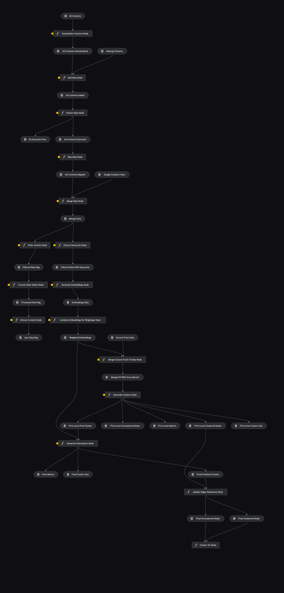

# Content Optimization

## Overview <a id="kedro-pipeline"></a>

> This Kedro project with Kedro-Viz set up was generated using `kedro 0.19.6`.

This visualization shows the current (latest) Kedro pipeline. This will be updated as the pipeline progresses.

<p align="center">
    
</p>

## Rules and Guidelines

- Don't remove any lines from the `.gitignore` file provided (although you may modify or add to it)
- Make sure any results can be reproduced by following a [data engineering convention](https://docs.kedro.org/en/stable/faq/faq.html#what-is-data-engineering-convention)
- Don't commit data to the repository
- Don't commit any credentials or local configuration to the repository. Keep all credentials and local configuration in [`conf/local/`](conf/local)

## Install Dependencies

<a id="note"></a>

> [!NOTE]
> This assumes that you have already created and activated your virtual environment. For more information on how to get set up, refer [here](../README.md#installation). From this section onwards, do also take note that you are in the `content-optimization` directory. Simply check by running `pwd` in your terminal and `cd content-optimization` if you're not already there.

### Anaconda (Recommended)

Declare any dependencies in `requirements.txt` for `pip` installation. To install them, run:

```zsh
pip install -r requirements.txt
```

### Poetry

If you're using Poetry instead, run:

```zsh
cat requirements.txt | xargs poetry add
```

## Set Up

Raw data is versioned using [Data Version Control (DVC)](https://dvc.org/). Before running the pipeline, we have to ensure that the raw data is available and up-to-date. For more information on data versioning best-practices, refer to the following section [below](#data-versioning).

Before proceeding to the [Raw Data](#raw-data-set-up) section to set up, please read the following sections [below](#integration-azure) to understand clearly the use of DVC, and how you can interact with this raw data:

### Integration of Data with Azure<a id="integration-azure"></a>

Azure Blob Storage is selected as our Remote Storage for DVC. A container named `raw` is created in the Enterprise Cloud for this purpose.

With the implementation of DVC, there are 3 Roles present:

1. **Data Controller** (Maintains Remote Storage + Google Drive)

   - Controls the raw data version in Azure
   - In-charge of `git push` the latest version of `.dvc` files to GitHub, so that Data Users can retrieve the correct data version from the remote storage
   - Updates the data files in Google Drive, for Data Viewers to view the data
     <br><hr>
   - Manages the Azure resources
   - Generate and disseminate the SAS token very time it expires within a set time period e.g. a month

2. **Data User** (Interacts with Remote Storage)

   - Pulls in versioned control data:
     - `git pull` to retrieve latest `.dvc` files, then
     - Run `get_raw_data.sh` or `get_raw_data.ps1` to retrieve latest data version locally for use in their code
   - Setup steps using scripts can be found under [Raw Data](#raw-data-set-up)

3. **Data Viewer** (Interacts with Google Drive)
   - View raw data found in the [Google Drive](https://drive.google.com/drive/folders/1RZe7qHWat8wxxYBDfdMSpZLHxqhCkYXV?usp=sharing)

### Azure Authentication

We use SAS Token as our authentication method to set up the remote configuration to the Azure Blob Storage. The Data Controller will perform the steps to generate the SAS Token.

**Steps (Generate SAS Token):**

1. Create an **Azure Storage Account**
2. Click on **+ Container** > Enter a name for your container › **Create**
3. Click on your new container > Under **Settings** › Click on **Shared access token**
4. Under **Signing method** > Select **Account key**
5. Under **Permissions** > Check **Read, Write, Delete** and **List**
6. Under **Start** and **Expiry** > Set the date and time
7. Under **Allowed protocols** > Select **HTTPS only**
8. Generate **SAS token and URL** > Copy the **SAS token**

> [!IMPORTANT]
> Once you exit the Azure page, you can no longer find the SAS token as Azure does not store it. It is important for **Data Controllers to note down the following details of the latest SAS token**:

1. Creation Date
2. Expiry Date
3. Blob SAS Token
4. Blob SAS URL

> [!IMPORTANT] > **The details of the latest SAS Token is as follows**:

```text
Creation Date: 9 Oct 2024
Expiry Date: 7 Feb 2025
SAS Token: Consult a Data Controller
```

### Raw Data<a id="raw-data-set-up"></a>

In the root of this project, you will find a [`.env.sample`](.env.sample). It should look like this:

```dotenv
AZURE_URL=
AZURE_STORAGE_ACCOUNT=
AZURE_STORAGE_SAS_TOKEN=
```

Create an `.env` file and copy and paste the contents from above into it.

> [!NOTE]
> Consult a Data Controller for the required credentials.

Once the environment variables have been set up, you can run the following command to set up the DVC configurations:

```zsh
./scripts/setup_dvc.sh
```

For Windows, run the following command:

```powershell
./scripts/setup_dvc.ps1
```

After running the command, the script would have added the remote data repositories in the [config](../.dvc/config) file and set the credentials in a local configuration file (i.e. not versioned controlled).

Lastly, run the following command to get the latest version of the raw data:

```zsh
./scripts/get_raw_data.sh
```

For Windows, run the following command:

```powershell
./scripts/get_raw_data.ps1
```

After running the command, you should see all the raw data populated within the [`data/01_raw/`](data/01_raw/) directory. It may take a while for all the data to be downloaded if this is your first time pulling in the raw data.

> [!TIP]
> If you encounter any issues, please consult a Data Controller. Usually, an error occurs when the SAS token has expired.

For more information, refer to this [user guide](https://dvc.org/doc/user-guide/data-management/remote-storage/azure-blob-storage) documentation in DVC.

### Data Versioning <a id="data-versioning"></a>

Below is a diagram showing the flow of data versioning.

<p align="center">
    
</p>

When you have made an update or change to the raw data, you can perform a commit operation to version the data:

```zsh
dvc add <PATH_TO_RAW_DATA>

# or you can simply run `dvc push --remote <REMOTE_NAME>` if you've only staged a single raw data
dvc push <PATH_TO_RAW_DATA> --remote <REMOTE_NAME>
```

You should see an updated version of a `.dvc` file of your updated raw data. It is best practice to version control to Git this `.dvc` file, whenever a change has been made to any raw data. This `.dvc` file tracks the versioning of your data and is crucial when you want to revert back to a previous version of your data. You may run the following commands to track changes in Git:

```zsh
git add <PATH_TO_RAW_DATA>.dvc
git commit -m "Raw dataset updated"
```

## File Structure

- [`conf/`](conf/): contains all configurations for the project

  - [`base/`](conf/base/): contains all configurations for the parameters used in the pipelines

  - [`local/`](conf/local/): contains all local configurations for the project like secrets and credentials (not to be checked into version control)

> [!IMPORTANT]
> If you find any discrepancies in the extracted or merged data, please [open an issue](https://github.com/Synapxe-DNA/healthhub-content-optimization/issues).

- [`data/`](data/): contains all data for the project at every stages; there are many sub-directories but here are the notable ones (will be updated as the pipeline progresses)

  - [`01_raw/`](data/01_raw/): contains all raw data

    - [`all_contents.dvc`](data/01_raw/all_contents.dvc): contains information about the data for the purpose of Git tracking. The original folder contains all raw data and was provided by HealthHub for the project.

    - [`missing_contents.dvc`](data/01_raw/missing_contents/): contains information about the data for the purpose of Git tracking. The original folder contains the content body of articles with `Excel Error` but were designated as `keep` by HealthHub. Do note that they should be in folders named as their respective content categories.

    - [`google_analytics_data.xlsx.dvc`](data/01_raw/google_analytics.xlsx.dvc): contains information about the data for the purpose of Git tracking. The original file contains the latest Google Analytics data patitioned by their content categories (i.e. 9 sheets in total).

  - [`02_intermediate/`](data/02_intermediate/): contains all intermediate data

    - `all_contents_standardized/`: contains all standardized data; kept only relevant columns and renamed the columns across all content categories to the same columns names

    - `all_contents_extracted/`: contains all extracted data; various data was extracted from the HTML content body.

    - `all_extracted_text/`: contains all the extracted HTML content body; saved as `.txt` files; for validation and sanity checks

    - `all_contents_mapped/`: contains all the new IA mappings as provided in the [kedro configuration](conf/base/parameters_data_processing.yml) as new columns

  - [`03_primary/`](data/03_primary/): contains the primary data; all processes (i.e. modeling) after data processing should only ingest the primary data

    - `merged_data.parquet/`: contains the merged data across all content categories and versioned; for more information on the data schema, refer [here](docs/MERGED_DATA_INFO.md#merged-data-information)

    - `filtered_data_with_keywords.parquet/`: contains the filtered data with keywords and versioned; for more information on the data schema, refer [here](docs/MERGED_DATA_INFO.md#merged-data-data-schema)

    - `filtered_data.parquet/`: contains the filtered data after removing the 'to_remove' categories for indexing; for more information on the data, refer [here](docs/PROCESSED_DATA_INFO.md#processed-articles-information)

    - `processed_data.parquet/`: contains the processed data after passing filtered_data into the LLM to clean the "content_body" column to the new "processed_table_content" for indexing; for more information on the data, refer [here](docs/PROCESSED_DATA_INFO.md#processed-articles-file-information)

    - `processed_articles/`: contains the JSON data for article content and article tables for ingestion into the index; for more information on the data, refer [here](docs/PROCESSED_DATA_INFO.md#processed-articles-file-information)

  - [`04_feature/`](data/04_feature/): contains the features data

  - [`08_reporting/`](data/08_reporting/): contains files and images for reporting; [`presentation.ipynb`](notebooks/presentation.ipynb) and [`word_count.ipynb`](notebooks/word_count.ipynb) generates an Excel file containing flagged articles for removal by type and distribution of raw and $\log{(word\\_count)}$

    - `flag_for_removal_by_type.xlsx/`: contains the flagged articles for removal by type saved as an Excel fileand versioned

    - `log_word_counts.html/`: contains the distribution of $\log{(word\\_count)}$ saved as a HTML file and versioned

    - `raw_word_counts.html/`: contains the distribution of raw word counts saved as a HTML file and versioned

- [`notebooks/`](notebooks): contains all notebooks for the project; for preliminary and exploratory analysis; code to be refactored into nodes and pipelines

> [!TIP]
> It is a good to do some exploratory work in this directory to understand how the data flows and get transformed through the pipeline. Simply run `catalog.list()` to see all available data and parameters. Simply run `catalog.load("<DATA_NAME | PARAMETER>")` to load the data or parameter. For more information, simply refer to one of the existing notebooks. Happy exploring!

- [`src/content_optimization/`](src/content_optimization): contains all code for the project; contains the code for respective pipelines

  - [`pipelines/`](src/content_optimization/pipelines): contains all code for the pipelines

    - [`data_processing/`](src/content_optimization/pipelines/data_processing): contains the code for the `data_processing` pipeline; for more information, refer [here](#data-processing)

    - [`feature_engineering/`](src/content_optimization/pipelines/feature_engineering): contains the code for the `feature_engineering` pipeline; for more information, refer [here](#feature-engineering)

    - [`clustering/`](src/content_optimization/pipelines/clustering): contains the code for the `clustering` pipeline; for more information, refer [here](#clustering)

    - [`azure_rag/`](src/content_optimization/pipelines/azure_rag): contains the code for the `azure_rag` pipeline; for more information, refer [here](#azure-rag)

- [`tests/`](tests): contains all unit and integrations tests for the Kedro pipeline; it is to be mirrored as per `data/` and `src/content_optimization/` directories. Refer [here](https://docs.kedro.org/en/stable/tutorial/test_a_project.html) for more information.

  - [`data/`](tests/data): contains all data for the project at every stage for the testing environment

  - [`pipelines/`](tests/pipelines): contains all the test cases for the pipelines

## Run the Kedro Project

Similarly, ensure you're in the correct directory. Refer [here](#note) for more information. You can simply run the Kedro project with:

```zsh
kedro run
```

This will run the entire project for all pipelines.

## Run Pipelines

### Data Processing <a id="data-processing"></a>

> [!IMPORTANT]
> Before running the `data_processing` [pipeline](src/content_optimization/pipelines/data_processing/pipeline.py), ensure that you have the raw data in the [`data/01_raw/all_contents/`](../content-optimization/data/01_raw/all_contents/) directory.

You can run the entire `data_processing` pipeline by running:

```zsh
kedro run --pipeline="data_processing"
```

If for any reason, you would like to run specific nodes in the `data_processing` pipeline, you can run:

```zsh
# Running only the `standardize_columns_node`
kedro run --nodes="standardize_columns_node"
```

If you want to run from a particular node to another node, you can run:

```zsh
# Running from `extract_data_node` to `merge_data_node`
kedro run --from-nodes="extract_data_node" --to-nodes="merge_data_node"
```

The pipeline is a [Directed Acyclic Graph (DAG)](https://en.wikipedia.org/wiki/Directed_acyclic_graph). You can view the visualization [here](#kedro-pipeline). This means that if it's your first time running the pipeline, you should ensure that the nodes are ran in order.

> [!NOTE]
> For example in the `data_processing` pipeline, you should run the `standardize_columns_node` first, followed by the `extract_data_node` then `merge_data_node`. After this, you may run the nodes in any order for subsequent runs. This is because there may be intermediate outputs that are required in subsequent nodes.

### Feature Engineering <a id="feature-engineering"></a>

> [!IMPORTANT]
> Before running the [`feature_engineering`](src/content_optimization/pipelines/feature_engineering/pipeline.py) pipeline, ensure that you have already ran the `data_processing` pipeline. Refer to the [Data Processing](#data-processing) section for more information.

You can run the entire `feature_engineering` pipeline by running:

```zsh
kedro run --pipeline="feature_engineering"
```

If for any reason, you would like to run specific nodes in the `feature_engineering` pipeline, you can run:

```zsh
# Running only the `extract_keywords_node`
kedro run --nodes="extract_keywords_node"
```

### Clustering <a id="clustering"></a>

> [!IMPORTANT]
> Before running the [`clustering`](src/content_optimization/pipelines/clustering/pipeline.py) pipeline, ensure that you have already ran the `data_processing` and `feature_engineering` pipeline. Additionally, ensure that Neo4j has been set up locally. You may refer to [Setting Up Neo4j](docs/SETTING_UP_NEO4J.md) for more information.

You can run the entire `clustering` pipeline by running:

```zsh
kedro run --pipeline="clustering"
```

### Azure RAG <a id="azure-rag"></a>

> [!IMPORTANT]
> Before running the [`azure_rag`](src/content_optimization/pipelines/azure_rag/pipeline.py) pipeline, ensure that you have already ran the `data_processing` pipeline. Additionally, ensure that access and credentials to Azure have been set up locally. You may refer to [Setting Up Azure](docs/SETTING_UP_AZURE.md) for more information.

You can run the entire `azure_rag` pipeline by running:

```zsh
kedro run --pipeline="azure_rag"
```

## Test the Kedro Project

### Unit Tests

```python
# TODO: Unit Tests Documentation
```

### Integration Tests

```python
# TODO: Integration Tests Documentation
```
